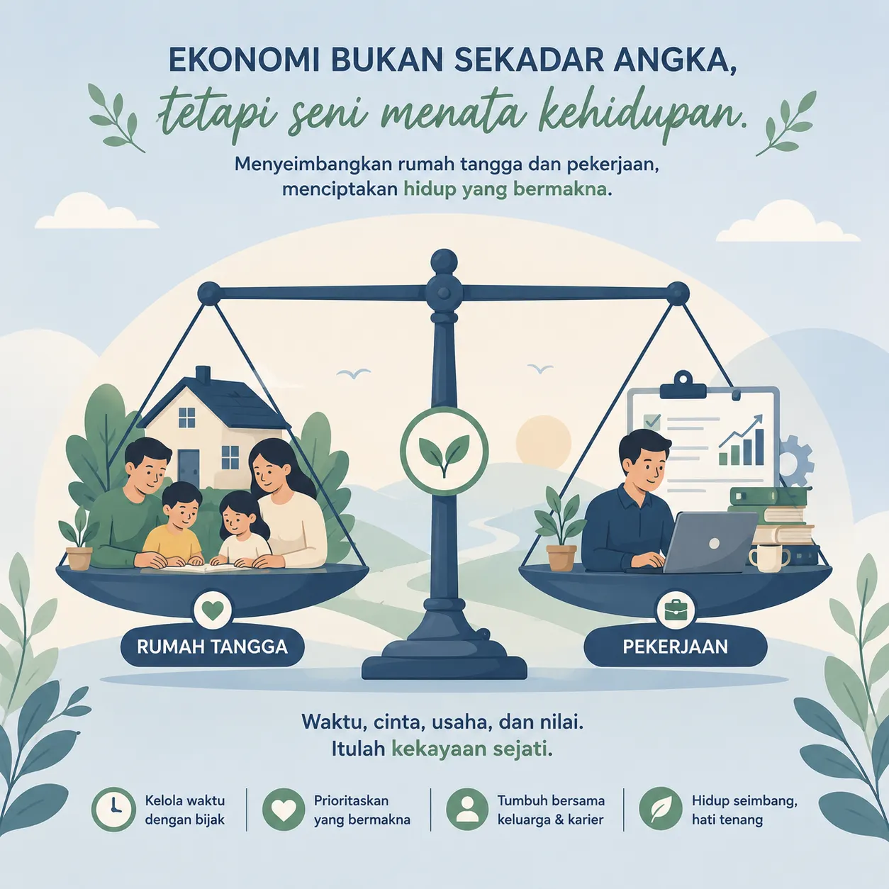

Ekonomi sering dipandang sebagai hitungan angka dan teori rumit. Padahal, pada hakikatnya ia adalah seni menjaga keseimbangan. Keseimbangan antara kebutuhan dan sumber daya, antara konsumsi dan tabungan, antara kepentingan pribadi dan kepentingan bersama.

Dalam kehidupan sehari-hari, kita selalu berhadapan dengan pilihan yang menuntut keseimbangan. Belanja secukupnya agar bisa menabung, bekerja keras namun tetap menjaga kesehatan, atau mengatur waktu antara keluarga dan pekerjaan. Semua itu adalah praktik ekonomi dalam bentuk paling nyata.

Belajar ekonomi berarti belajar menata hidup dengan bijak. Ia mengajarkan kita bahwa kesejahteraan bukan hanya soal materi, tetapi juga tentang bagaimana kita menyeimbangkan berbagai aspek kehidupan agar tetap harmonis.