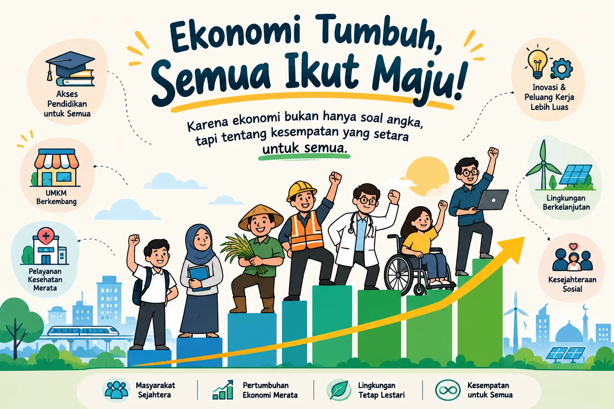

Ekonomi bukan hanya soal angka dan keuntungan, tetapi juga tentang bagaimana kesejahteraan dibagi secara adil. Keadilan sosial menjadi salah satu tujuan penting dalam sistem ekonomi, karena tanpa pemerataan, pertumbuhan hanya akan dinikmati segelintir orang.

Dalam kehidupan nyata, keadilan ekonomi terlihat dari akses pendidikan, kesehatan, dan kesempatan kerja. Ketika semua orang memiliki peluang yang sama, maka ekonomi tidak hanya tumbuh, tetapi juga menyejahterakan. Prinsip ini mengingatkan kita bahwa ekonomi sejati adalah ekonomi yang berpihak pada manusia, bukan sekadar pada angka.

Belajar ekonomi berarti memahami bahwa keseimbangan antara efisiensi dan keadilan adalah kunci. Pertumbuhan tanpa pemerataan akan melahirkan kesenjangan, sementara pemerataan tanpa produktivitas akan menghambat kemajuan. Keduanya harus berjalan beriringan.