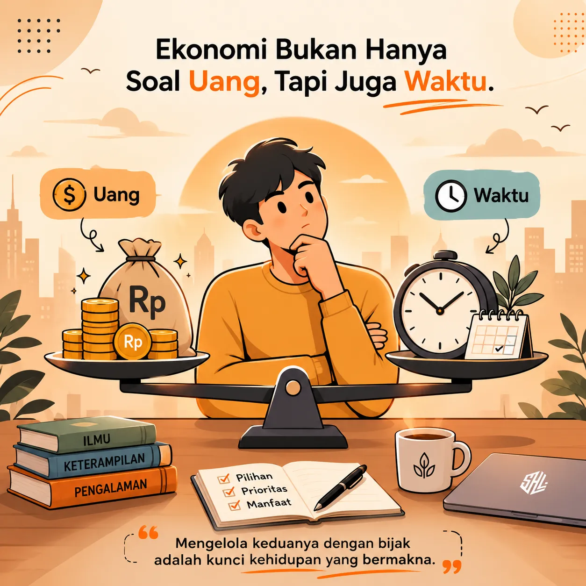

Ekonomi bukan hanya teori di ruang kuliah atau angka di laporan negara. Ia hadir dalam setiap keputusan kecil yang kita buat. Saat memilih antara membeli kopi atau menabung, saat menentukan apakah bekerja lembur atau pulang lebih cepat, kita sedang berhadapan dengan prinsip ekonomi.

Intinya sederhana: setiap pilihan memiliki biaya dan manfaat. Dengan memahami ekonomi, kita belajar menimbang keduanya agar hidup lebih bijak. Ekonomi membantu kita melihat bahwa kesejahteraan bukan hanya soal uang, tetapi juga tentang bagaimana kita mengelola waktu, tenaga, dan kesempatan.

Belajar ekonomi berarti belajar memahami diri sendiri dan masyarakat. Ia mengajarkan kita bahwa keputusan kecil bisa berdampak besar, dan bahwa keseimbangan antara kebutuhan dan sumber daya adalah kunci kehidupan yang berkelanjutan.